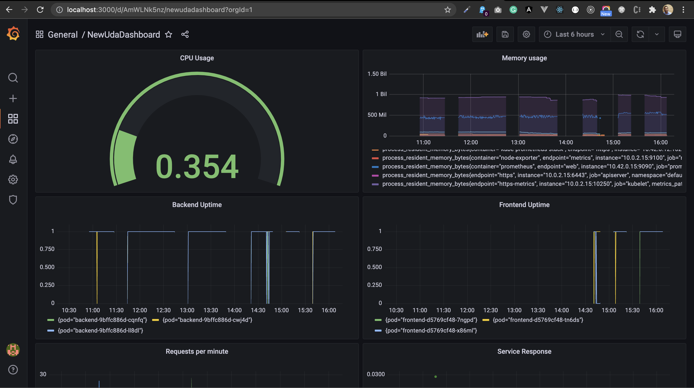

**Note:** For the screenshots, you can store all of your answer images in the `answer-img` directory.

## Verify the monitoring installation

*TODO:* run `kubectl` command to show the running pods and services for all components. Take a screenshot of the output and include it here to verify the installation

## Setup the Jaeger and Prometheus source
*TODO:* Expose Grafana to the internet and then setup Prometheus as a data source. Provide a screenshot of the home page after logging into Grafana.

## Create a Basic Dashboard
*TODO:* Create a dashboard in Grafana that shows Prometheus as a source. Take a screenshot and include it here.

## Describe SLO/SLI
*TODO:* Describe, in your own words, what the SLIs are, based on an SLO of *monthly uptime* and *request response time*.

- **SLI's (Service-Level Indicator)** An specific metric use to mesure the performance of and application or services 

- **SLO (service Level Object)** Usualy is what your organizacion require for mesuring the application uptime of 99.9% and the aver age request response time of a web request would take < 1 seconds to complete

## Creating SLI metrics.
*TODO:* It is important to know why we want to measure certain metrics for our customer. Describe in detail 5 metrics to measure these SLIs. 

- HTTP ERROR
- Uptime
- Trafic
- Letancy
- API'S Calls 

## Create a Dashboard to measure our SLIs
*TODO:* Create a dashboard to measure the uptime of the frontend and backend services We will also want to measure to measure 40x and 50x errors. Create a dashboard that show these values over a 24 hour period and take a screenshot.

## Tracing our Flask App
*TODO:*  We will create a Jaeger span to measure the processes on the backend. Once you fill in the span, provide a screenshot of it here.

## Jaeger in Dashboards
*TODO:* Now that the trace is running, let's add the metric to our current Grafana dashboard. Once this is completed, provide a screenshot of it here.

## Report Error
*TODO:* Using the template below, write a trouble ticket for the developers, to explain the errors that you are seeing (400, 500, latency) and to let them know the file that is causing the issue.

TROUBLE TICKET

Name: Error 500

Date: Nov 7 6:00pm

Subject: backend service route "/star"

Affected Area: Backend service 

Severity: Urgent 

Description: went running backend service route "/star" get a error and the service fail

## Creating SLIs and SLOs
*TODO:* We want to create an SLO guaranteeing that our application has a 99.95% uptime per month. Name three SLIs that you would use to measure the success of this SLO.

- Applications service uptime 
- CPU and memory usage 
- Request and Response time 
- Http Errors (4xx or 5xx error)

## Building KPIs for our plan
*TODO*: Now that we have our SLIs and SLOs, create KPIs to accurately measure these metrics. We will make a dashboard for this, but first write them down here.

- Backend and Frontend Uptime
    - Mesure the availability of services Uptime to make sure it is accessible for the client
- Error Rate mesure (4xx or 5xx error):
    - Measure the number of failed (non HTTP 200) responses per second
- CPU and Memory usage    
    - Server CPU and memory usage, keep on low to prevent loss availability of services.

## Final Dashboard
*TODO*: Create a Dashboard containing graphs that capture all the metrics of your KPIs and adequately representing your SLIs and SLOs. Include a screenshot of the dashboard here, and write a text description of what graphs are represented in the dashboard.  

